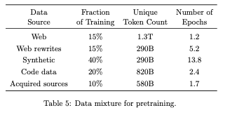
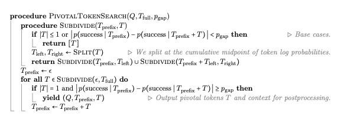
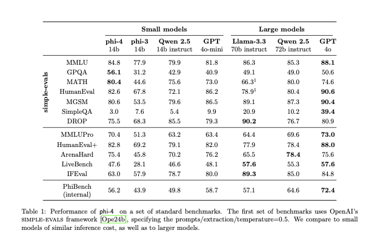
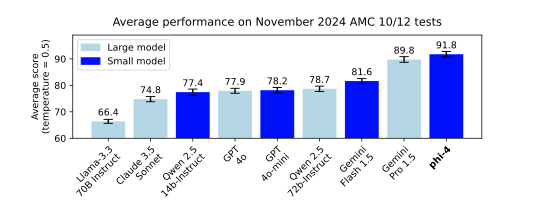

# 1. Introduction and Background

This project presents **Phi-4**, a 14-billion-parameter language model released by Microsoft Research in 2025.  
Phi-4 continues the philosophy of the Phi model family — focusing on **data quality and reasoning curriculum**, rather than brute-force scaling of model size.

The central principle guiding Phi-4 is:

> **“High-quality data matters more than model scale.”**

While previous generations of Phi models primarily relied on *distillation from GPT-4* to inherit reasoning ability,  
Phi-4 goes a step further — it **surpasses its teacher model in STEM reasoning tasks**,  
demonstrating that data generation and post-training alignment can outperform simple imitation.

Key features introduced in this version include:
- Large-scale **synthetic educational data** generation via multi-agent prompting, self-revision, and instruction reversal;
- **Curriculum-style pretraining** that mixes web, code, and book data for structured learning;
- A novel **post-training alignment method**, combining *Pivotal Token Search (PTS)* with *Direct Preference Optimization (DPO)*.

Together, these innovations enable Phi-4 to achieve GPT-4-level reasoning while being one-tenth its size —  
proving that *data quality and thoughtful design can rival scale and compute*.

# 2. Motivation and Overview

Recent advances in large language models (LLMs) have shown that scaling parameters and compute yields diminishing returns.  
Training ever-larger models is costly and environmentally intensive, yet their reasoning improvement slows down.

**Phi-4** aims to demonstrate an alternative path — *smaller models trained on better data.*

Its design rests on three foundational pillars:

1. **High-quality synthetic data** — generated through 50 pipelines combining multi-agent prompting, self-revision, and instruction reversal.  
   These synthetic datasets focus explicitly on reasoning, mathematics, and scientific problem solving.

2. **Filtered and curated organic data** — selected from the web, licensed books, and code repositories.  
   These sources serve both as direct pretraining material and as *educational seeds* for synthetic data generation.

3. **Innovative post-training alignment** — introducing a two-stage optimization process:  
   - Stage 1: *Pivotal Token Search (PTS)* — a token-level preference optimization method that focuses on critical reasoning steps.  
   - Stage 2: *Judge-Guided DPO* — GPT-4o is used as a “judge” to rate responses on accuracy, style, and completeness.

By combining these pillars, Phi-4 shifts the paradigm from **“bigger is better” to “smarter is better.”**

It proves that careful curriculum design and precise alignment can enable a 14B model  
to match or even surpass 100B+ parameter systems in reasoning-heavy tasks.

# 3. Synthetic Data and Generation Pipeline

Synthetic data lies at the heart of Phi-4’s performance gains.  
Unlike traditional pretraining that relies on random web text, Phi-4’s synthetic datasets were **explicitly engineered to teach reasoning.**

## 3.1 Why Synthetic Data?
- **Structured and progressive learning:**  
  Organic text often contains loosely related tokens, making it difficult for models to learn reasoning dependencies.  
  In contrast, synthetic sequences are explicitly structured — each token depends on logical steps, allowing Phi-4 to internalize *chain-of-thought* reasoning.

- **Task-format alignment:**  
  Synthetic data closely mirrors the contexts encountered during reasoning and problem solving.  
  Training on such data ensures that the model’s pretraining experience aligns with its real-world inference scenarios.

## 3.2 Data Generation Workflow
1. **Seed Selection** – select educationally rich content from books, research articles, and high-quality web text.  
2. **Rewriting and Enrichment** – transform raw paragraphs into reasoning tasks, exercises, or discussions.  
3. **Self-Revision** – the model evaluates and iteratively improves its own generated answers.  
4. **Instruction Reversal** – generate prompts from solutions or code snippets to balance instruction-response distributions.  
5. **Verification** – execute code or validate factual and numerical correctness.

Each step converts unstructured knowledge into structured reasoning lessons, forming a *curriculum-style training dataset.*

---

## 3.3 Data Composition

The final pretraining mixture was tuned through multiple ablation studies.  
The optimal combination balances synthetic, organic, and code data to achieve both reasoning depth and factual coverage.

| Data Source | Token Share | Unique Tokens | Typical Epochs |
|--------------|--------------|----------------|----------------|
| Web Data | 15% | 1.3T | 1.2 |
| Web Rewrites | 15% | 290B | 5.2 |
| Synthetic Data | **40%** | 290B | 13.8 |
| Code Data | 20% | 820B | 2.4 |
| Books / Academic Texts | 10% | 580B | 1.7 |

---





*Composition of the Phi-4 training data mixture showing synthetic (40%), web + rewrites (30%), code (20%), and books (10%).*

This balanced mixture allows Phi-4 to benefit from synthetic data’s structure  
while maintaining factual grounding and domain diversity through curated organic sources.

# 4. Pretraining and Mid-Training

Phi-4 is built on a **decoder-only Transformer** architecture with 14 billion parameters.  
While the architecture remains largely similar to Phi-3, the performance leap comes from **data design and training strategy** rather than structural changes.

## 4.1 Model Architecture
- **Parameters:** 14B  
- **Context length:** 4K (pretraining) → 16K (mid-training)  
- **Tokenizer:** TikToken, vocabulary size = 100,352  
- **Attention:** full self-attention (no sliding window)  
- **Framework:** PyTorch with DeepSpeed optimization and mixed-precision training.

## 4.2 Pretraining Phase
The model was trained on approximately **10 trillion tokens** using a linear warm-up and cosine decay schedule.  
- Peak learning rate: **3 × 10⁻⁴**  
- Weight decay: **0.1**  
- Global batch size: **5,760**  
- Total training tokens: **10T**

Ablation studies revealed:
- Increasing *synthetic data repetitions* produced stronger reasoning gains than simply adding more unique web tokens.  
- However, purely synthetic training led to factual degradation and mild hallucination — thus, a small percentage of organic web and book data was retained for knowledge grounding.

## 4.3 Mid-Training Phase
To extend reasoning over longer contexts, Phi-4 underwent a **mid-training stage**:
- The context length was increased from 4K → **16K**.  
- RoPE positional encoding base increased to **250K**, enabling longer token dependency tracking.  
- Additional **250B long-text tokens** (code, books, academic documents >8K) were added.  
- The learning rate was reduced by 10× to ensure stability during this expansion.

This mid-training step improved Phi-4’s ability to reason across extended documents  
and strengthened its performance on long-context benchmarks such as **HELMET**.

# 5. Post-Training and Alignment

The **post-training phase** transforms the pretrained Phi-4 model into a safe, helpful, and reasoning-capable assistant.  
It consists of three main stages: **Supervised Fine-Tuning (SFT)**, **Pivotal Token Search (PTS-DPO)**, and **Judge-Guided DPO.**

---

## 5.1 Supervised Fine-Tuning (SFT)
Phi-4 is first fine-tuned using approximately **8 billion ChatML-formatted tokens**.  
The dataset covers domains such as mathematics, code, logical reasoning, safety, and multilingual dialogues (40 languages).  
This phase helps the model adapt to human-style instruction-following and conversational formats.

---

## 5.2 Stage 1 – Pivotal Token Search (PTS-DPO)

Traditional **Direct Preference Optimization (DPO)** compares entire responses,  
but this can blur learning signals when only a few tokens determine the success of a reasoning chain.  
**Pivotal Token Search (PTS)** addresses this by identifying *key tokens* where the model’s success probability shifts significantly,  
and performing DPO only on those pivotal regions.

---



* The Pivotal Token Search (PTS) algorithm recursively subdivides token sequences and yields pivotal tokens where the success probability changes beyond a threshold.*

**Algorithm Overview:**

```text
procedure PIVOTALTOKENSEARCH(Q, T_full, p_gap)
    procedure SUBDIVIDE(T_prefix, T)
        if |T| ≤ 1 or |p(success | T_prefix) - p(success | T_prefix + T)| < p_gap then
            return [T]
        T_left, T_right ← Split(T)
        return SUBDIVIDE(T_prefix, T_left) ∪ SUBDIVIDE(T_prefix, T_right)
    for all T in SUBDIVIDE(ε, T_full) do
        if |T| = 1 and |p(success | T_prefix) - p(success | T_prefix + T)| ≥ p_gap then
            yield (Q, T_prefix, T)
        T_prefix ← T_prefix + T、
```


---

### Explanation

- The algorithm evaluates a token sequence **T_full** for a given prompt **Q**.  
- It computes how much the model’s predicted *success probability* changes when each token **T** is added.  
- If this probability jump exceeds a threshold (**p_gap**), that token is marked as *pivotal.*  
- The model then applies **token-level preference optimization** on those pivotal tokens only,  
  producing stronger, cleaner gradients for reasoning accuracy.

In essence, PTS teaches the model *where* in a reasoning chain correctness truly matters —  
rather than forcing it to mimic full responses.

---

## 5.3 Stage 2 – Judge-Guided DPO

After PTS-DPO, Phi-4 undergoes another preference optimization stage.  
Here, **GPT-4o acts as a judge**, scoring 850,000 response pairs based on:  
- **Accuracy**  
- **Style**  
- **Level of detail**

Responses with higher composite scores are labeled as *preferred*.  
This process refines the model’s writing clarity, factual precision, and safety alignment.

---

## 5.4 Hallucination Mitigation

A dedicated subset of “refusal data” was added — examples where the model must respond  
**“I don’t know”** when uncertain, instead of fabricating answers.  
This approach reduced hallucinations on **SimpleQA** and other factual tasks by a large margin.

---

## 5.5 Summary Pseudocode of the Full Alignment Process

```python
# === Phi-4 Alignment Pipeline ===

# Stage 1: Supervised Fine-Tuning
sft_data = load_chatml_data(domains=["math", "code", "reasoning", "safety", "multilingual"])
fine_tune(model, sft_data, lr=1e-6)

# Stage 2: PTS-DPO (token-level)
for good, bad in pivotal_token_pairs:
    loss = dpo_loss(model, good, bad, focus="pivotal_tokens")
    update(model, loss)

# Stage 3: Judge-Guided DPO
for good, bad, judge_score in judge_scored_pairs:
    loss = dpo_loss(model, good, bad, weight=judge_score)
    update(model, loss)

# Optional: hallucination-safety fine-tuning
add_refusal_data(model)
evaluate_alignment(model, metrics=["accuracy", "safety", "factuality"])
```

# 6. Overall Training Pipeline Pseudocode

The following pseudocode summarizes the entire Phi-4 training and alignment process,  
adapted from Microsoft’s [official Hugging Face repository](https://huggingface.co/microsoft/phi-4).

It illustrates how **data-centric design**, not architectural complexity, drives performance improvement.

---

```python
# === Phi-4 Full Training Pipeline ===

# -------------------------------------------------------
# Stage 1: Pretraining (Data-centric initialization)
# -------------------------------------------------------

data_mix = prepare_data(
    web=0.3,        # filtered web and web rewrites
    synthetic=0.4,  # reasoning-focused synthetic data
    code=0.2,       # Python, math, algorithmic tasks
    books=0.1       # academic and educational texts
)

model = TransformerDecoder(num_params=14e9, context_length=4096)

train(
    model,
    dataset=data_mix,
    tokens=10e12,
    lr=3e-4,
    weight_decay=0.1,
    scheduler="cosine",
    batch_size=5760
)

# -------------------------------------------------------
# Stage 2: Mid-Training (Context extension and stability)
# -------------------------------------------------------

extend_context(model, length=16000, rope_base=250000)
train(
    model,
    dataset=long_text_data,  # >8K token documents
    tokens=2.5e11,
    lr=3e-5
)

# -------------------------------------------------------
# Stage 3: Supervised Fine-Tuning (SFT)
# -------------------------------------------------------

sft_data = load_chatml_data(
    domains=["math", "code", "reasoning", "safety", "multilingual"]
)
fine_tune(model, sft_data, lr=1e-6)

# -------------------------------------------------------
# Stage 4: Alignment via DPO
# -------------------------------------------------------

# Token-level preference optimization (PTS-DPO)
for good, bad in pivotal_token_pairs:
    loss = dpo_loss(model, good, bad, focus="pivotal_tokens")
    update(model, loss)

# Judge-guided preference optimization (Judge-DPO)
for good, bad, score in judge_scored_pairs:
    loss = dpo_loss(model, good, bad, weight=score)
    update(model, loss)

# -------------------------------------------------------
# Stage 5: Safety Reinforcement
# -------------------------------------------------------

add_refusal_data(model)  # teach the model to say "I don't know"
evaluate_alignment(
    model,
    metrics=["accuracy", "safety", "factuality"]
)

# -------------------------------------------------------
# Final Save
# -------------------------------------------------------

save_model(model, "phi-4-final")
```

# 7. Audience Questions

Before moving on to results, let’s pause for a short reflection.  
I’d like to ask two quick questions to connect the audience with the core ideas of the paper.

---

### Question 1
**Why can high-quality synthetic data sometimes outperform real web text for reasoning tasks?**

*Hint:*  
Synthetic data is **structured, balanced, and noise-free**.  
It allows the model to practice reasoning in a curriculum-like sequence rather than memorizing scattered web tokens.  
This teaches the model *how to think*, not just *what to predict*.

---

### Question 2
**What risks arise when models rely too heavily on self-generated (synthetic) data?**

*Hint:*  
Such models may develop a **feedback-loop bias**—learning from their own mistakes—and gradually drift away from real-world facts.  
To avoid this, Phi-4 mixes synthetic data with curated organic sources (books, code, web rewrites).

# 8. Experimental Results

After completing all pretraining and alignment stages, Phi-4 was evaluated across multiple reasoning, coding, and factual benchmarks.

---

## 8.1 Overall Benchmark Comparison



* Phi-4 achieves state-of-the-art performance among 14 B models, outperforming Qwen 2.5 (14 B) and GPT-4o-mini on most reasoning and coding tasks.*

| Benchmark | Phi-4 (14 B) | GPT-4o-mini | Qwen 2.5 (14 B) |
|------------|--------------|--------------|----------------|
| MMLU | **84.8** | 81.8 | 79.9 |
| GPQA | **56.1** | 49.1 | 42.9 |
| MATH | **80.4** | 73.0 | 75.6 |
| HumanEval+ | **82.8** | 77.9 | 63.3 |
| Arena-Hard | 75.4 | 68.5 | 70.2 |
| IFEval | 63.0 | 67.9 | 59.7 |

Phi-4 surpasses all 14 B peers on 9 out of 12 public benchmarks.  
Especially in **STEM reasoning** and **code synthesis**, it performs on par with much larger closed models.

---

## 8.2 AMC 10/12 Mathematical Reasoning



*Figure 2. Phi-4 achieves an average AMC 10/12 score of 91.8, outperforming larger models like Gemini Pro (89.8) and GPT-4 (78.7).  
Error bars show ±2 σ over 100 runs at t = 0.5 temperature.*

These results confirm that Phi-4’s reasoning improvements are not due to data leakage or memorization.  
Instead, they reflect **true generalization** gained from structured synthetic data and the PTS-DPO alignment strategy.

---

## 8.3 Long-Context Evaluation

In long-document reasoning tasks (e.g., HELMET benchmark),  
the 16 K-context version of Phi-4 matches the performance of models over 5× its size (such as Llama-3 70 B).  
This demonstrates that the **mid-training phase** successfully extended contextual reasoning without sacrificing precision.

# 9. Safety and Internal Evaluation

Beyond raw performance, Microsoft evaluated Phi-4 extensively on **safety, robustness, and responsible AI (RAI)** dimensions.  
This section summarizes how the team ensured that improved reasoning did not come at the cost of unsafe or biased behavior.

---

## 9.1 PhiBench – Internal Evaluation Suite
To address the limitations of public benchmarks, the researchers designed **PhiBench**, an internal benchmark collection focused on originality and reasoning diversity.

**Key features:**
- **Original questions** written by the research team → prevents data contamination.  
- **Skill diversity:** evaluates debugging, reasoning explanations, proof correction, and conceptual problem generation.  
- **Structured judging notes:** standardized evaluation criteria reduce style bias in LLM-based grading.

PhiBench serves both as a diagnostic tool and as feedback for future dataset design.

---

## 9.2 Responsible AI (RAI) Benchmarking
Phi-4 was tested across Microsoft’s *Responsible AI* framework,  
which includes **five harm categories**: misinformation, bias, fairness, safety, and privacy.

- The model’s responses were scored on a 0–5 scale for *groundedness* and 0–7 for *harm severity (DR-x)*.  
- Results show strong grounding (average ≥4.5) and low severe harm rates (DR1 < 1%).  
- GPT-4o-based red-team evaluation confirmed stable refusal behavior when faced with adversarial or unsafe prompts.

---

## 9.3 Red-Team Testing
The **Microsoft AI Red Team (AIRT)** conducted two weeks of adversarial testing, including:
- Prompt injection and jailbreak attacks,  
- Encoded or multi-turn coercion attempts,  
- Social manipulation and misinformation scenarios.

Phi-4 displayed robust defense capabilities comparable to larger commercial models.  
Several minor failure modes identified during testing were addressed with targeted safety fine-tuning.

# 10. Limitations and Future Work

Despite its impressive reasoning ability, Phi-4 still exhibits several limitations typical of mid-sized language models.  
These issues highlight important directions for future research.

| Limitation | Observation | Proposed Improvement |
|-------------|--------------|----------------------|
| **Factual Hallucination** | Occasionally fabricates biographical or niche facts (“Who is X?” → invented person). | Integrate **retrieval-augmented generation (RAG)** for real-time fact grounding. |
| **Weak Instruction Following** | Struggles to produce outputs with strict formatting or bullet structure. | Expand training with **format-constrained synthetic samples** and instruction-style data. |
| **Verbose Answers** | Chain-of-thought exposure leads to overly long, redundant explanations for simple questions. | Add **concise-answer training tasks** to balance reasoning depth and brevity. |
| **Residual Bias / Safety Risks** | Although mitigated by red-teaming, subtle bias and unsafe completions can still appear. | Broaden **RAI harm coverage** and perform continual red-team evaluation. |

---

### Discussion
While Phi-4 successfully minimizes many weaknesses of prior open models,  
these remaining issues reveal that *data-centric intelligence still requires continual grounding*.  
Future versions (e.g., **Phi-5**) are expected to integrate **retrieval mechanisms, multi-turn reasoning**, and **adaptive context compression**  
to further bridge the gap between small and large LLMs.

# 11. Impact and Significance

Phi-4 represents a **paradigm shift** in how we think about language model scaling and intelligence.  
Instead of pursuing size and compute, it focuses on **data quality, structure, and alignment** — proving that small models can reason deeply when trained the right way.

---

## 11.1 Academic Significance
- **Data-Centric AI:** Phi-4 demonstrates that improving *data quality* can yield gains equivalent to, or greater than, scaling parameters.  
- **Synthetic Curriculum Design:** Its generation pipeline formalizes how LLMs can be taught via stepwise reasoning data, inspiring new educational approaches in machine learning.  
- **Methodological Innovation:** The introduction of **Pivotal Token Search (PTS)** and **Judge-Guided DPO** provides new research tools for efficient and interpretable alignment.

---

## 11.2 Engineering and Practical Impact
- **Cost Efficiency:** Achieves GPT-4-level reasoning at a fraction of the compute budget — ideal for deployment in constrained environments.  
- **Generalization and Safety:** Combines reasoning power with robust safety mechanisms, making it suitable for real-world applications.  
- **Accessibility:** Being open-weight and mid-sized, Phi-4 allows both academia and industry to experiment without proprietary barriers.

---

## 11.3 Societal and Future Implications
- Encourages a move toward **“responsible intelligence scaling”** — prioritizing safety and interpretability over raw model size.  
- Enables educational and enterprise AI systems that are **powerful yet controllable**.  
- Lays the groundwork for future hybrid architectures that combine **symbolic reasoning**, **retrieval grounding**, and **LLM creativity**.

---

> **In short:** Phi-4 proves that intelligence does not have to be enormous —  
> it just needs to be educated.


# 12. Conclusion

Phi-4 redefines what “scaling intelligence” means.  
Instead of growing larger, it grows *smarter* — driven by high-quality data, structured reasoning, and precise alignment.

Through its curriculum-style synthetic datasets and innovative post-training (PTS + DPO),  
Phi-4 achieves GPT-4-level reasoning at one-tenth the scale, while remaining safer and more efficient.

**Key message:**  
> Intelligence does not require size — it requires education.

Phi-4 demonstrates that *data design* and *training structure* can rival raw scale and compute,  
paving the way for future small but powerful models such as **Phi-5**.

---

# 13. References

1. Microsoft Research. *Phi-4 Technical Report*. 2025.  
   https://www.microsoft.com/research/publication/phi-4-technical-report/
2. [Phi-4 Official Repository – Hugging Face](https://huggingface.co/microsoft/phi-4)  
3. Rafailov, R. et al. *Direct Preference Optimization: Your Language Model is Secretly a Reward Model.* ICLR, 2024.  
4. Zhou, K. et al. *Self-Revision: Teaching Models to Think Before They Answer.* arXiv, 2024.  
5. Microsoft Responsible AI Standard. *Responsible AI Principles and Evaluation Framework.* 2024.  
6. Touvron, H. et al. *LLaMA-3: Open and Efficient Foundation Models.* Meta AI, 2024.

